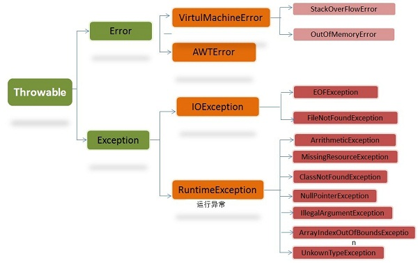

## 面向对象和面向过程
### 面向对象
面向对象易维护、易复用、易扩展，因为面向对象有 __封装、继承、多态__ 等特性，所以面向对象程序更加灵活。
但相对于面向过程程序面向对象程序 __性能相对较低__。
### 面向过程
面向过程相较于面向对象 __性能较高__，但是面向过程没有面向对象易维护、易复用、易扩展等特性。

## JVM & JDK & JRE
### JVM
Java虚拟机，运行Java字节码，JVM针对不同的操作系统有不同的版本，通过不同系统版本的JVM实现Java的跨平台性。
#### 字节码
在Java中，JVM能够理解的代码就叫做字节码，它不面向任何特定的处理器，只面向JVM虚拟机。
### JDK
Java开发环境，它包含JRE所有的一切。
### JRE
Java运行环境，它包含运行已编译的Java程序所需的所有内容，包括JVM虚拟机。
### OpenJDK & OracleJDK
#### OpenJdk
OpenJDK是一个参考模型，它是完全开源的。
#### OracleJDK
OracleJDK是OpenJDK的一个实现，它并不完全开源，它比OpenJDK更稳定。

## Java & C++
- 都是面向对象语言
- Java不提供指针来直接访问内存，所以程序内存更加安全
- Java只能单继承多实现，C++支持多继承
- Java自动内存管理，不需要程序员去管理内存
- C++的字符串和字符数组都要以 __\0__ 结尾，而Java不需要，因为Java中一切皆是对象，那么字符串就有长度，编译器可以根据字符串长度确定字符串的结束，而不需要根据特定的标识符。

## 字符常量 ＆ 字符串常量
- 外观上：字符常量以单引号引起；字符串常量以双引号引起。
- 含以上：字符常量相当于一个整型值，可以进行表达式运算；字符串常量是一个内存地址值。
- 空间上：字符常量占用两个字节；字符串常量是一个字符数组。

## 重载 & 重写
- 重载：在同一个类中，方法名相同、参数列表不同。
- 重写：子类对父类方法的新实现，方法名相同、参数列表相同、返回值范围小于等于父类、抛出异常范围小于等于父类、访问范围大于等于父类，__private函数不能被重写__

## 封装 & 继承 & 多态
- 封装：封装是把一个对象的属性私有化，然后提供一些可以被外界访问属性的方法。
- 继承：继承是使用已存在的类定义作为基础构建新的类。子类拥有父类对象 __所有__ 的属性和方法；子类可以拥有自己的属性和方法；子类可以用自己的方式实现父类的方法。
- 多态：多态是程序中定义的引用变量所指的具体类型只能在运行期才能确定。实现多态的两种方式：继承、实现

## String & StringBuffer & StringBuilder
由于String字符串是被final & private修饰的字符数组表示，所以String对象是不可变的。
```java
    private final char value[]; 
```
StringBuffer & StringBuilder都继承自AbstractStringBuilder类，在AbstractStringBuilder类的字符数组没有被final修饰，所以StringBuffer & StringBuilder都是可变的
由于String中的对象不可变，所以String是线程安全的；StringBuffer对操作字符数组的函数都添加了同步锁，所以StringBuffer是线程安全的；StringBuilder没有对操作字符数组函数添加同步锁，所以StringBuilder是线程不安全的。
String类型每次发生改变的时候，都会生成一个新的String对象，然后将指针指向新的String对象；而StringBuffer & StringBuilder是对对象本身进行操作。

## 装箱与拆箱
- 装箱：将基本类型用它们对应的引用类型包装起来
- 拆箱：将包装类型转换成对应的基本数据类型

## 接口 & 抽象类
- 接口的方法默认是public的，除了default方法，其它修饰符的方法都不能有实现；抽象类中可以有抽象方法和非抽象方法
- 接口中的属性只能是 static final的；抽象类中则随意
- 一个类可以实现多个接口，但只能实现一个抽象类；接口本身可以多继承
- 抽象类是对类的抽象，是一种模板设计；接口是对行为的抽象，是一种行为规范

## equals & hashCode
### equals()
equals函数的作用是比较两个对象是否相等，在Object类中定义了equals()函数用来判断两个对象的地址值是否相等，Object类中的equals函数等价于==方法，所以我们通常会重写equals函数，来比较两个对象的内容是否相等。
```java
    public boolean equals(Object obj) {
        return (this == obj);
    }
```
#### equals() & ==
- ==是比较两个对象的地址值是否相等
- 如果没有重写equals，那么equals等价于==；如果重写了equals，那么equals是比较两个对象的内容是否相等
### hashCode()
hashCode函数的作用是获取哈希码（散列码），它实际上是返回一个int整数，这个哈希码的作用是确定对象在哈希表中的索引位置。 __hashCode函数只有在[散列表](../algorithm/HashTable.md#hashtable)中才有用，其他情况下没用。__
### hashCode() & equals() 规定
- 如果两个对象相等，则hashCode也一定相同
- 如果两个对象相等，则两个对象的equals返回true
- 两个对象的hashCode相同，它们并不一定相等

## final关键字
final关键字主要修饰在三个地方：类、方法、变量
- 类：当类被final修饰时，该类不能被继承，final类中所有的成员方法都会被隐式的指定为final方法
- 方法：
    - 把方法锁定，以防任何继承类修改它的含义
    - 会把final方法转为内嵌调用，可以提升执行效率
- 变量：
    - 如果是基本类型的变量，则其数值一旦在初始化后就不能更改
    - 如果是引用类型的变量，则在对其进行初始化之后就不能再让它指向另一个对象

## 异常

在Java中，所有的异常是Throwable的派生类。主要分为两大类：Error & Exception
### Error（错误）
程序无法处理的错误，
### Exception（异常）
